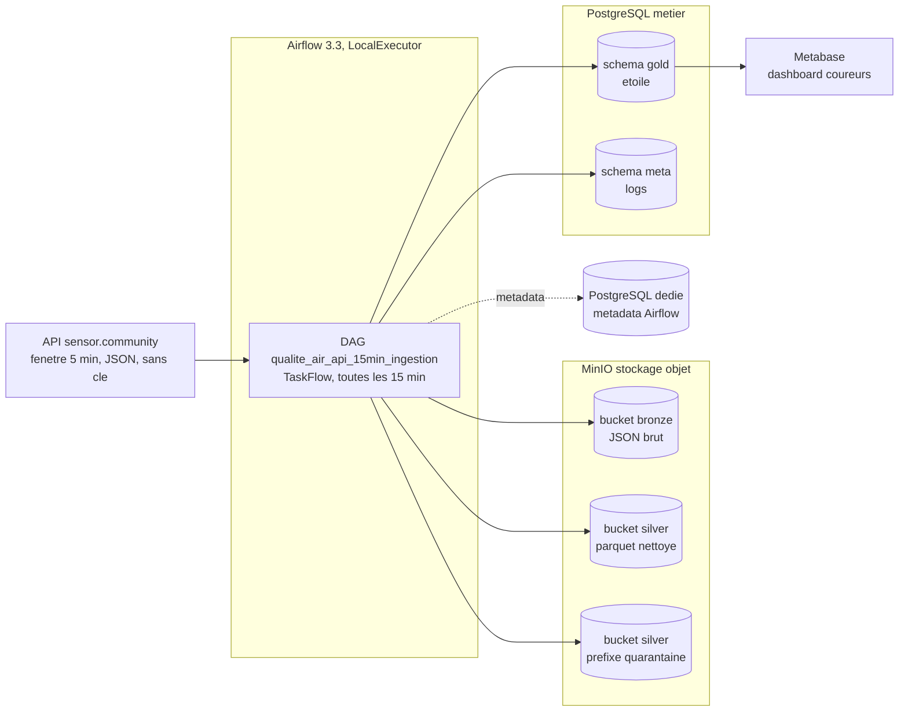
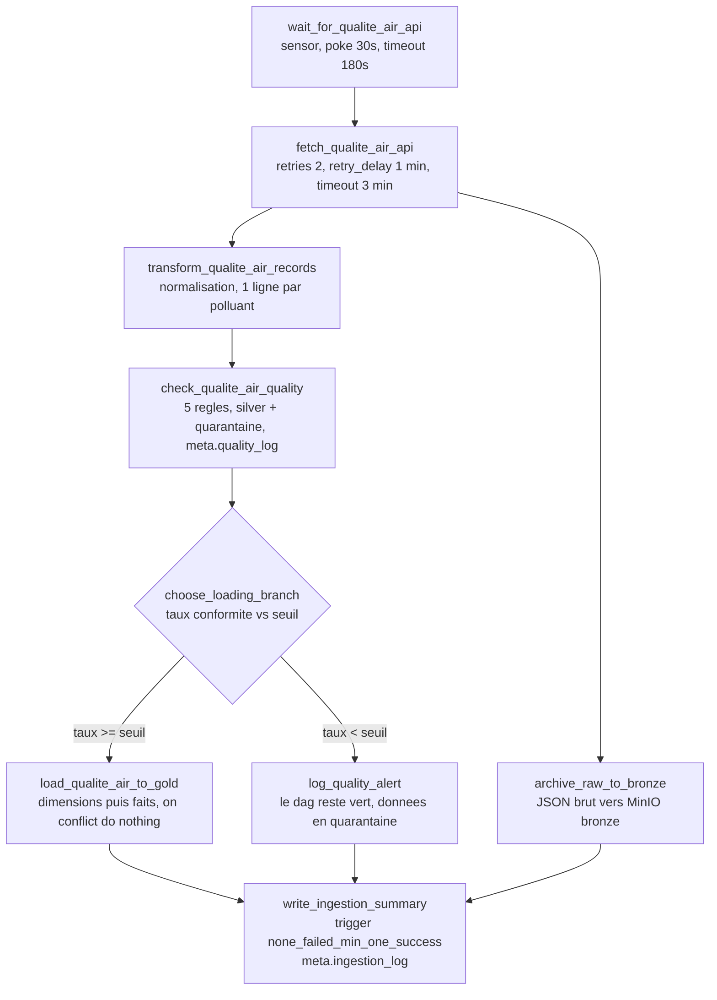
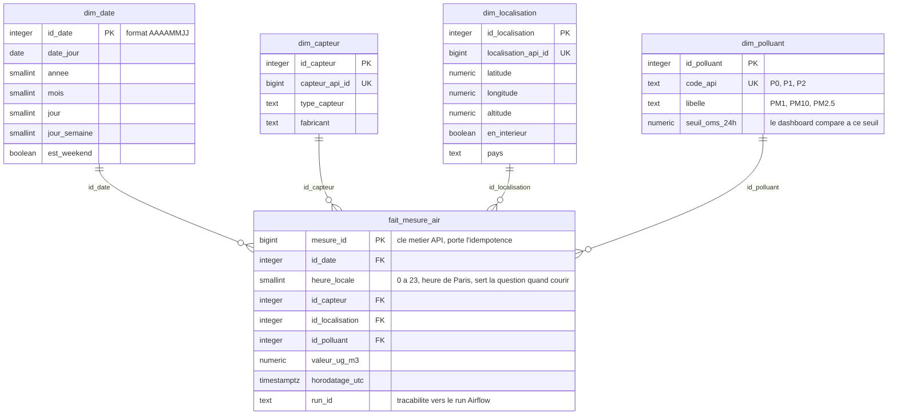

# Document de conception

Produit avant toute ligne de code, comme demande dans l'enonce. Quatre volets :
architecture data, diagramme du pipeline, modele gold en etoile, formulation du probleme
metier (cette derniere est detaillee dans [cadrage_metier.md](cadrage_metier.md)).

## 1. Schema d'architecture data

Choix structurants :

- Trois zones distinctes. Bronze : la reponse API brute, format d'origine JSON, append only,
  rejouable. Silver : donnees normalisees et typees en parquet, partitionnees a la mode hive
  (`annee=AAAA/mois=MM/jour=JJ`), avec un prefixe `quarantaine/` qui recoit les lignes
  rejetees et leurs motifs. Gold : PostgreSQL, modele en etoile, consomme par Metabase.
- La metadata db d'Airflow vit dans une base PostgreSQL dediee (`postgres-airflow`),
  jamais melangee a la base metier (`postgres-metier`). SQLite est exclu : le DAG comporte
  des taches independantes executables en parallele (archivage bronze et transformation
  partent toutes les deux de l'ingestion), d'ou LocalExecutor.
- Metabase stocke sa configuration dans sa propre base `metabase` sur l'instance metier,
  et lit les donnees dans le schema gold uniquement.

## 2. Diagramme du pipeline

Les trois chemins exiges et la maniere de les demontrer :

| Chemin | Declencheur pour la demo | Resultat attendu |
|---|---|---|
| Nominal | rien a changer, run planifie ou manuel | tout vert, gold alimente, une branche skippee (normal) |
| Echec qualite | variable `qualite_air_pm_max` a 1 | dag vert, `load` skippee, lignes en quarantaine dans silver, alerte loggee |
| Echec technique | variable `qualite_air_api_url` vers un hote inexistant | sensor en echec apres 180 s, dag rouge |

Doctrine de robustesse appliquee :

- retries et retry_delay sur les taches d'entree sortie (`fetch`, `archive`, `load`) :
  une API ou un service de stockage peut tousser temporairement.
- pas de retries sur `transform` et `check` : rejouer un calcul deterministe sur les memes
  donnees ne change rien.
- execution_timeout explicite sur toutes les taches, en plus du timeout HTTP de 10 s dans
  le code : deux filets independants.
- le chargement gold est idempotent, donc ses retries sont sans risque de doublon.
- XCom ne transporte que du petit : la fenetre JSON fait moins d'un mega octet, les chemins
  d'objets MinIO et les rapports qualite. Le volumineux vit dans MinIO.
- logging a deux niveaux : les logs Airflow par tache dans l'interface, et les logs metier
  transverses dans `meta.ingestion_log` (une ligne par run) et `meta.quality_log` (une ligne
  par regle et par run).

## 3. Modele gold : schema en etoile

Grain de la table de faits : une mesure d'un polluant par un capteur a un instant donne.

Justifications :

- `heure_locale` est portee par le fait (dimension degeneree) parce que la question metier
  est une question de creneau horaire : l'agregation par heure est le coeur du dashboard.
- le seuil OMS vit dans `dim_polluant` : le dashboard compare les mesures au seuil par une
  jointure, sans valeur en dur dans les requetes.
- `dim_localisation` conserve `en_interieur` : un capteur d'interieur ne dit rien de l'air
  d'un parcours de course, le dashboard filtre dessus.
- idempotence : `mesure_id` (identifiant de la valeur cote API) est cle primaire, le
  chargement fait `INSERT ... ON CONFLICT (mesure_id) DO NOTHING`. Les doublons sont deja
  ecartes en silver par la regle unicite, la contrainte SQL reste en filet de securite.
  Les requetes de preuve sont dans [../sql/verification_idempotence.sql](../sql/verification_idempotence.sql).

## 4. Les cinq regles qualite

Appliquees au passage bronze vers silver, chacune comptee et loggee separement dans
`meta.quality_log`. Une ligne rejetee part en quarantaine avec ses motifs.

| Regle | Controle concret sur ces donnees |
|---|---|
| completude | identifiants, horodatage, coordonnees et valeur presents |
| exactitude | valeur castable en nombre, entre 0 et `qualite_air_pm_max` (defaut 999, le SDS011 sature a 999.9 qui est son code d'erreur connu), coordonnees GPS plausibles, point 0,0 rejete |
| coherence | pas d'horodatage dans le futur, et PM2.5 inferieur ou egal a PM10 sur un meme releve, l'inverse trahit un capteur qui deraille |
| fraicheur | horodatage plus recent que `qualite_air_fraicheur_max_minutes` (defaut 60) au moment du run |
| unicite | pas de doublon d'identifiant API ni de doublon capteur + instant + polluant dans le lot |

## 5. Conventions de nommage

| Objet | Convention | Application ici |
|---|---|---|
| DAG | domaine + processus + frequence | `qualite_air_api_15min_ingestion` |
| Taches | verbe + objet + contexte | `fetch_qualite_air_api`, `check_qualite_air_quality`, `load_qualite_air_to_gold` |
| Tables de faits | prefixe `fait_` | `gold.fait_mesure_air` |
| Dimensions | prefixe `dim_`, cle `id_` | `gold.dim_date`, `id_date` |
| Logs | schema `meta` | `meta.ingestion_log`, `meta.quality_log` |
| Objets bronze | domaine/date/run | `qualite_air/2026-07-07/<run_id>.json` |
| Objets silver | partitionnement hive | `qualite_air/mesures/annee=2026/mois=07/jour=07/<run_id>.parquet` |
| Quarantaine | meme partitionnement | `qualite_air/quarantaine/annee=2026/mois=07/jour=07/<run_id>.parquet` |
